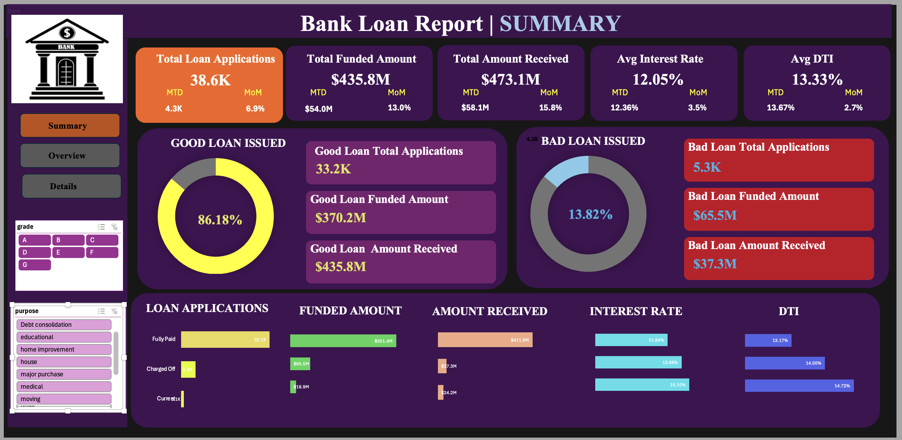

# 🏦 Bank Loan Risk & Performance Analytics Dashboard

An interactive Excel dashboard that analyzes bank loan portfolio performance, repayment trends, and credit risk using KPIs and visual analytics to support data-driven lending decisions.

---

## 📌 Project Overview
Banks receive thousands of loan applications and maintain large volumes of financial data including loan amount, interest rate, borrower income, and repayment history.  
However, raw data alone does not help management understand whether the bank is growing safely or taking high risk.

This project builds a **complete reporting system in Excel** to monitor:

- Loan performance
- Repayment behavior
- Borrower risk
- Lending trends

The dashboard transforms raw banking data into meaningful insights for decision making.

---

## 🎯 Problem Statement
Banks struggle to quickly evaluate loan portfolio health because data is scattered across multiple records.  
Managers cannot easily identify risky loans, repayment trends, or monthly performance changes.

This dashboard provides a **single source of truth** that allows stakeholders to monitor lending activity and detect potential risks early.

📄 Full Problem Statement: Loan_Report.pdf

---

## 📊 Dashboard Structure

### 1️⃣ Summary Dashboard
Provides high-level KPIs of lending performance.

**Key Metrics**
- Total Loan Applications
- Total Funded Amount
- Total Amount Received
- Average Interest Rate
- Average Debt-to-Income Ratio (DTI)
- Month-to-Date (MTD) & Month-over-Month (MoM) trends

**Good vs Bad Loan Analysis**
- Good Loans → Fully Paid + Current
- Bad Loans → Charged Off

---

### 2️⃣ Overview Dashboard
Visual trend analysis across multiple dimensions:

- Monthly loan trends
- Regional (state-wise) lending analysis
- Loan term distribution
- Employment length impact
- Loan purpose breakdown
- Home ownership analysis

---

### 3️⃣ Details Dashboard
Provides a detailed table view of all loan records for filtering and deep analysis.

---

## 📷 Dashboard Preview

### Summary Dashboard

### Overview Dashboard

---

## 🧠 Key Business Insights Enabled
- Detect high-risk borrowers early
- Understand repayment behavior
- Monitor portfolio growth
- Track default percentage
- Support lending decision strategy

---

## 🛠 Tools & Skills Used
- Microsoft Excel
- Pivot Tables
- Data Cleaning
- KPI Design
- Financial Risk Analysis
- Data Visualization
- Business Intelligence

---

## 📈 Business Value
This solution helps banks:
- Reduce loan default risk
- Improve profitability
- Make faster decisions
- Monitor financial health of portfolio

---

## 👩‍💻 Author
**Pournima Kamble**  
Master’s Student — Computer Science  
Data Analytics | Data Engineering | Business Intelligence
